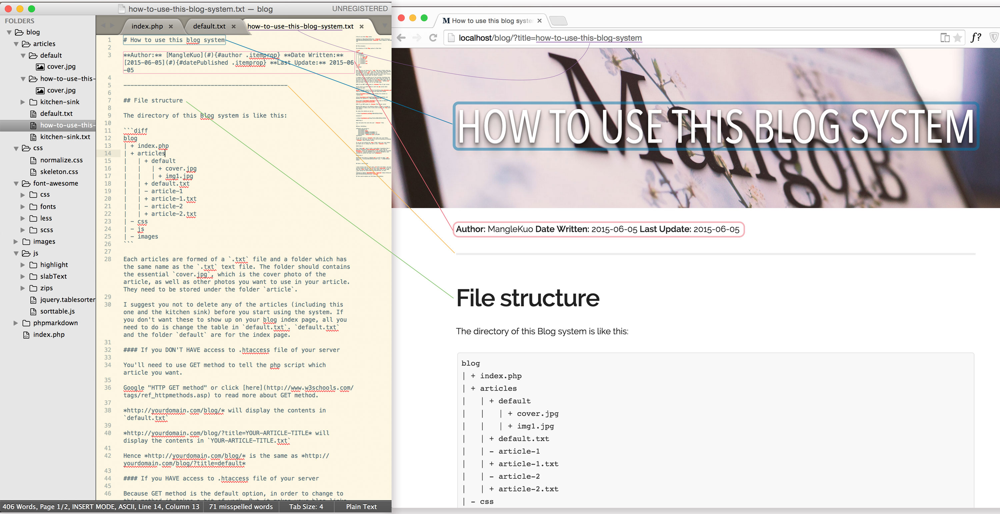
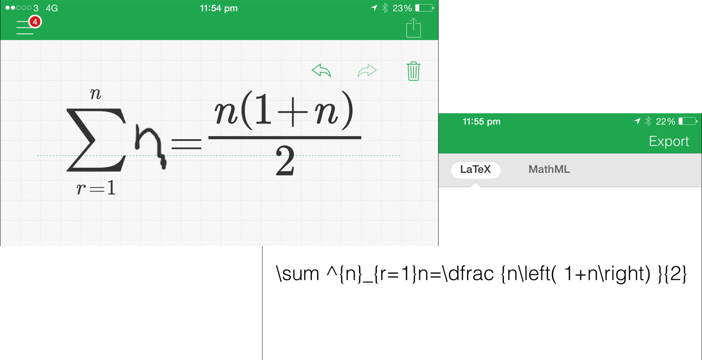
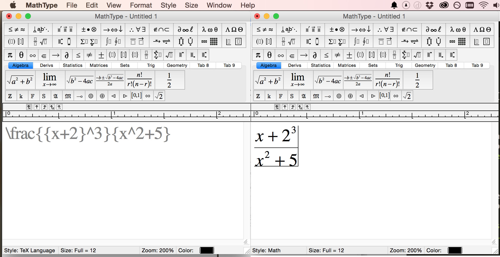

# How to use this blog system

**This is a shrinked version of the original page. Some content will not display as expected on GitHub hence they are removed. Download all the files onto your server and open *http://YOUR-DOMAIN/mangolb/?title=how-to-use-this-blog-system* to read the full article**

## Before you start

1. This system is based on PHP. Make sure you have PHP up and running on your server/computer
2. In order to reduce the file size, I'm using CDN for jQuery and MathJax. The font Raleway is also hosted by Google Font online. Hence a good internet connection is required. You can host them yourself if you want.
3. If you have any question about this documentation, or you've seen some mistakes, please don't be hesitate to contact me by email: [ghcpuman902@gmail.com](mailto:ghcpuman902@gmail.com) or [other ways](http://manglekuo.com/#contact).

## File structure

The directory of this Blog system is like this:

```
| + mangolb/
|	| + index.php
|	| + articles/
|	|   | + default/
|	|   |   | + cover.jpg
|	|   |   | + img1.jpg
|	|   | + default.txt
|	|   | - article-1/
|	|   | + article-1.txt
|	|   | - article-2/
|	|   | + article-2.txt
|	| - css/
|	| - js/
|	| - images/
```

Each articles are formed of a `.txt` file and a folder which has the same name as the `.txt` text file. The folder should contains the essential `cover.jpg`, which is the cover photo of the article, as well as other photos you want to use in your article. Both of them need to be stored under the folder `articles/`. 

I suggest you not to delete any of the articles (including this one and the kitchen sink) before you start using the system. If you don't want these to show up on your blog index page, all you need to do is change the table in `default.txt`. `default.txt` and the folder `default/` are for the index page.

#### If you DON'T HAVE access to .htaccess file of your server 

You'll need to use GET method to tell the php script which article you want.

Google "HTTP GET method" or click [here](http://www.w3schools.com/tags/ref_httpmethods.asp) to read more about GET method.

*http://yourdomain.com/mangolb/* will display the contents in `default.txt`

*http://yourdomain.com/mangolb/?title=YOUR-ARTICLE-TITLE* will display the contents in `YOUR-ARTICLE-TITLE.txt`

Hence *http://yourdomain.com/mangolb/* is the same as *http://yourdomain.com/mangolb/?title=default*

#### If you HAVE access to .htaccess file of your server

Because GET method is the default option, in order to change to this method it takes a bit of work. But it makes your blog links look better.

By using this method you can use 

> *http://yourdomain.com/mangolb/YOUR-ARTICLE-TITLE* 

instead of 

> *http://yourdomain.com/mangolb/?title=YOUR-ARTICLE-TITLE*

##### Step 1

Copy and paste this code into your `.htaccess` file:

```
Options -MultiViews

<IfModule mod_rewrite.c>
    RewriteEngine On
    RewriteBase /mangolb/
    RewriteCond %{REQUEST_FILENAME} !-f
    RewriteCond %{REQUEST_FILENAME} !-d
    RewriteRule . /mangolb/index.php [L,NC,QSA]
</IfModule>
```

If you don't have a `.htaccess` file under your root folder, create one. You might not be able to see the existing one because `.htaccess` file's usually hidden.

If you are not putting the `mangolb/` folder under your root folder, you might want to change the path in the `.htaccess` file.

##### Step 2

Find `index.php`, open it with a code-editor (something like [Sublime Text](http://www.sublimetext.com/)), then find "@.htaccess". Follow the instructions of the comments that are below "@.htaccess" (comment SECTION A and uncomment SECTION B, both sections are within 30 lines from "@.htaccess"). 

##### Step 3

Change all the links in `default.txt` as well as other `.txt` files from "./?title=YOUR-ARTICLE-TITLE" into  "./YOUR-ARTICLE-TITLE".

## Start a new article

##### Step 1: Give your new article a name

You need have two titles, one is for the name of your `.txt` file, another is your display title.

If your display title is "This is a wonderful story about Apple, Banana & Orange", I suggest you use "this-is-a-wonderful-story-about-apple-banana-and-orange" as the name of your `.txt` file and your folder.

Create a folder and a `.txt` file with the name you just decided, put both of them under `articles/`.

```
| + articles/
|   | + this-is-a-wonderful-story-about-apple-banana-and-orange/
|   |   | + cover.jpg
|   | + this-is-a-wonderful-story-about-apple-banana-and-orange.txt
```
You can ignore the `cover.jpg` by now.

Now open your `this-is-a-wonderful-story-about-apple-banana-and-orange.txt` or what ever you've named it.

Specific your display title by putting a `# YOUR TITLE` at the beginning of your `.txt` file. Each article has to have one and only one \# title (`<h1>` title).

Javascript is used to apply SlabText to it, and move it into the cover section. Search "@SlabText" and "@PutH1IntoCover" in `index.php` to see the codes corresponding to it.

SlabText will split headlines into rows before resizing each row to fill the available horizontal space. In this case, the headline is our `<h1>` title.

Your new `.txt` file should look like this by now :

*articles/this-is-a-wonderful-story-about-apple-banana-and-orange.txt:*

```
# This is a wonderful story about Apple, Banana & Orange
```

##### Step 2: Give your article a cover picture

I suggest you use a cover picture that does not have much bright area in it to provide a good contrast for the white title. Especially on IE, when the text-shadow is not supported. The subject of the picture should be at the centre of the image. I'm using `background-size: cover;` in css to control the size of my background image. A good explanation of how it works can be find on [here](http://blog.vjeux.com/2013/image/css-container-and-cover.html).

The recommended image size is at least 2000px wide, 1000px high, compress it with things like the "Save for Web" in Photoshop to reduce the size of the file.

Save it as `cover.jpg` under the folder.

```diff
| + articles/
|   | + this-is-a-wonderful-story-about-apple-banana-and-orange/
|   |   | + cover.jpg       <-SAVE IT HERE
|   | + this-is-a-wonderful-story-about-apple-banana-and-orange.txt
```

##### Step 3: Provide the author name and date written

When giving the Author Name and Date Written, do this: 

```
**Author:** [AUTHOR NAME](#){#author .itemprop} **Date Written:** [YYYY-MM-DD](#){#datePublished .itemprop}
```
Please change the capitalised words into your own information.

To do so allows the search engines to find these informations.

I'm actually using a trick here. I'm using the syntax for links or `<a>` elements here, the php scripts in the `index.php` will convert it into `<span>` elements with corresponding attributes instead.

You can find the corresponding code by searching "@itemprop" in `index.php`.

You can also add extra information about the article behind these two.

Your new `.txt` file should look like something like this by now :

*articles/this-is-a-wonderful-story-about-apple-banana-and-orange.txt:*

```
# This is a wonderful story about Apple, Banana & Orange

**Author:** [MangleKuo](#){#author .itemprop} **Date Written:** [2015-05-29](#){#datePublished .itemprop} **LAST UNDATE** 2015-06-13 **Type:** Article

-----------------------------------------------

Start adding things here...
```

The line is not essential but it does make your article looks better.

 

##### Step 4: Start writing using Markdown and LaTeX! 

If you are not familiar with Markdown, [this](http://markdowntutorial.com/) is a really really good tutorial about Markdown made by GitHub. However, some extra feature is added from the original Markdown documentation. Read more about the extra feature [here](https://michelf.ca/projects/php-markdown/extra/).

When I talk about "LaTeX", I'm more focusing on the Maths Symbol part of it, the ideal of writing 2D Maths equations using plain text. If you want to learn more about it, read these web pages:

+ [http://www.latex-tutorial.com/symbols/](http://www.latex-tutorial.com/symbols/)
+ [https://www.sharelatex.com/learn/Mathematical_expressions](https://www.sharelatex.com/learn/Mathematical_expressions)

Or you can purchase and download [MyScript MathPad](https://itunes.apple.com/gb/app/myscript-mathpad-handwriting/id674996719?mt=8) for iPhone & iPad to hand write Maths formula



I'm using [MathType](http://www.dessci.com/en/products/mathtype/) on my Mac to generate formula virtually. It works on windows as well. If you have MathType, go to Preferences -> Cut and Copy Preferences, then choose MathML or TeX: LaTeX 2.09 and later to allow it output as LaTeX format.




## Things to be careful about

#### Reserved Characters

Another thing is to be careful about reserved characters...

Weird things will happen if you try to use `#` and `[]` in your text content.

That's because `#` is used for Markdown, and `[]` are used for both Markdown and LaTeX.

For Markdown syntax, you can add a backward slash `\` before the characters you want to use.

So if you do

```diff
\#1...Tom Scott  
\#2...Jack Wilkinson  
```

it will becomes:

\#1...Tom Scott   
\#2...Jack Wilkinson   

Great! What about the `[]`?

Hmmm.. Unfortunately for some reason it just won't work. My suggestion is avoid using `[]` in the text contents.

Here are characters which you might experience issues:

```
!$#%&*()[]{}-+_;<>`
```

If they are not appearing or appearing not in the way you are expecting, try to put a backward slash "\" before the character you want to use and see if it helps. Otherwise avoid using them.

Oh, and also the tab key. It's for block code. Use spaces instead.

#### Insert Picture

**This part will not display as expect on GitHub hence it is removed. Download all the files and open *http://YOUR-DOMAIN/mangolb/?title=how-to-use-this-blog-system* to read the full article**


## THE END

If you have any questions or problems, please contact me through email: [ghcpuman902@gmail.com](mailto:ghcpuman902@gmail.com). You are also welcomed to folk this on GitHub and make any comments.
